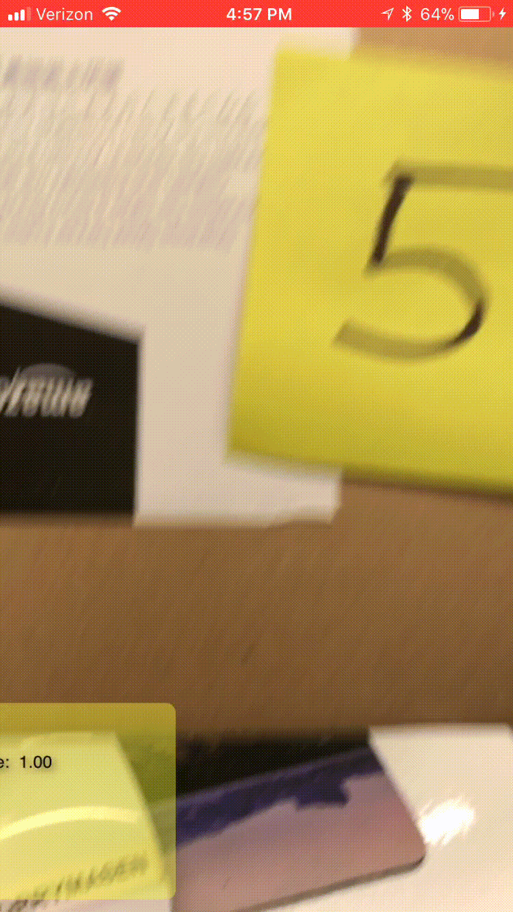

# Recognizing Hand Written Digits in Live Capture

Adaptation of Apple's [Breakfast Finder](https://developer.apple.com/videos/play/wwdc2018/717) app that recognizes handwritten digits during live capture. 

Works best if the digit is on a rectangle such as a Post-It note. 50% of the time it works 100% of the time.

## Overview

Recognizes rectangles through a `VNDetectRectanglesRequest` then feeds that to a `VNCoreMLRequest` using classifier trained on MNIST data by Apple. 
Classification of the digit as well as confidence is shown on screen.

